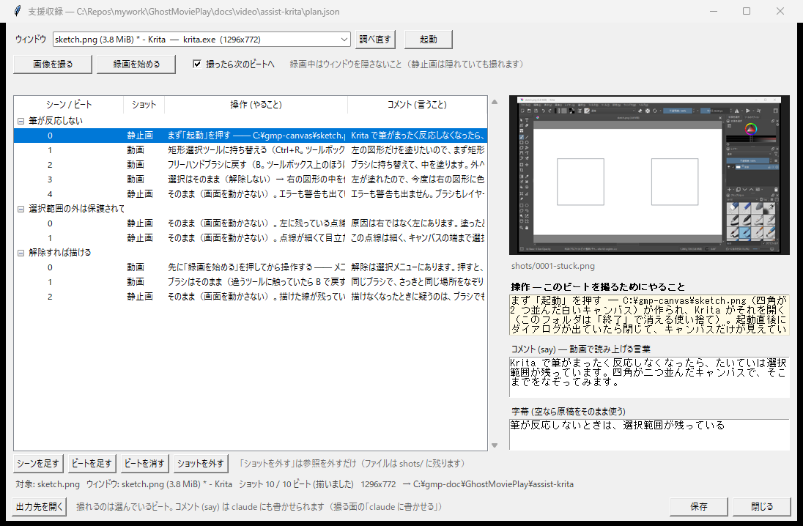
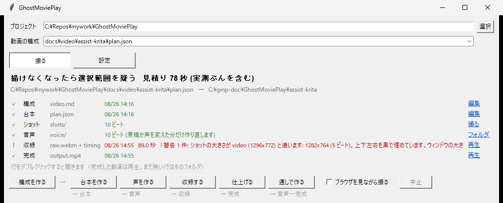

# Windows アプリを撮る（支援収録）

[README](README.md) — **自動操作が届かない相手**を、人が操作して撮るための手引き。
Claude への頼み方と、自分で手を動かす部分の進め方をここにまとめる。

書式の仕様は [docs/plan.md](docs/plan.md#自動操作が届かない相手を撮る支援収録)、
実例は [docs/video/assist-7zip/](docs/video/assist-7zip/)（7-Zip、約 69 秒）と
[docs/video/assist-krita/](docs/video/assist-krita/)（Krita、約 89 秒。**録画を含む**）。
**Gallery から落とした設定で撮るなら** [README_BUNDLE.md](README_BUNDLE.md)。

## まず、本当にこれが要るか

**Web で撮れるなら使わないこと。** 支援収録は**決定論を捨てる** ——
撮り直しが無料でなくなり、[`gmp check`](docs/check.md) の腐敗検知も効かなくなる。
引き合うのは、`gmp record` が**原理的に届かない**相手だけ。

| | |
| --- | --- |
| ✅ 向いている | OAuth（自動化ブラウザは弾かれる）、canvas や独自描画、Windows のネイティブアプリ、自動操作が許されない業務アプリ |
| ❌ 向いていない | ブラウザで開けて、ログインも台本に書ける普通の Web アプリ |

迷ったら [docs/plan.md のログインの節](docs/plan.md#ログインが要るアプリを撮る)を先に読む。
素の form ログインなら台本に書くほうが壊れにくい。

## 全体の流れ

**人が手を動かすのは 3 番だけ。** あとは自動収録と同じ。

```
1. 構成をつくる      video.md に app.window とシーンの狙いを書く   ← Claude
2. 台本をつくる      ビートごとに do (やること) と say (言うこと)  ← Claude
3. ショットを撮る    gmp shoot でアプリを操作しながら撮る          ← 人
4. 声をつくる        gmp voice                                     ← 機械
5. 収録する          ショットを並べて raw.mp4 + timing.json        ← 機械
6. 仕上げる          字幕と音声を乗せて output.mp4                 ← 機械
```

**順番に注意。** 自動収録は `voice` → `record` だが、こちらは**撮る → `voice` →
`record`**。画が先にあるので、足りない分は最後のフレームで埋める。

## Claude への頼み方

対象プロジェクトを開いた Claude Code に、そのまま貼る。

### 1本まるごと

```
GhostMoviePlay の支援収録で、<アプリ名> の実演解説動画を 1 本作って。
このアプリは自動操作が届かないので、撮るのは私がやる。

- gmp init で構成 (video.md) を作り、app.window に撮るウィンドウのタイトルを書いて
  (部分一致。app.url は空文字で打ち消す)
- 起動コマンドがあるなら app.start に書いて。ドライブ名は書かないこと
- 台本 (plan.json) は skills/ghostplay/SKILL.md に従って書いて。
  actions と shot は書かない。代わりに do を必ず書く
- do は「どこにあるか」まで書いて。私はこのアプリに詳しくない
- do は「そのビートを撮る直前の状態」から書いて。前のビートの続きのつもりで
  省かれると、ダイアログを開き直して入力が消えていることに気づけない
```

### 構成 (video.md) だけ

```
docs/video/<名前>/video.md を書いて。支援収録の 1 本にしたい。
app.window に <アプリ名> のウィンドウタイトルを入れて、app.url は空文字で打ち消して。
scenes は「失敗例 → 何が悪かったか → 正解ルート」の 3 幕で goal を書いて。
セリフや操作手順 (plan.json) はまだ書かないで。
```

### 台本 (plan.json) だけ

```
@<出力先>/PLAN_REQUEST.md の指示に従って plan.json を作って。
支援収録なので actions は書かず、ビートごとに do (撮る人がやること) を必ず入れて。
do は「どの画面か：やること」の形で始めて。
```

依頼文の場所は `gmp plan <video.md>` が出す。

### 撮る前に「仕込み」を頼む

実データを映さないために、**撮影用のダミーを作るスクリプト**を書かせる。

```
撮影用のダミーを作る make_sample.py を書いて、app.setup に繋いで。
- 実ファイルは使わない。中身の無いダミーを、それらしい名前で置くだけ
- 置き場所は浅いパスにして (タイトルバーとアドレスバーの 2 か所に出るので)
- --clean で消せるようにして、app.teardown に繋いで
- 後半のビートだけ撮り直せるように、「途中まで進んだ状態」を作る引数も付けて
```

### 撮ったあとで直す

```
output.mp4 を観た。<ビート> の言い回しが硬いので say を短くして。
絵は変えないで。
```

```
do のとおりにやったら <どこ> で詰まった。実際は <こう> だったので直して。
```

## 進め方（自分で操作する部分）

### 1. 撮る画面を開く

```powershell
uv run gmp shoot docs/video/<名前>/plan.json
```

`gmp ui --run` の**ショットの行をダブルクリック**しても同じ。
ショットの行は `app.window` が埋まっている 1 本にだけ出る。



上から **撮るウィンドウの欄**（`起動` で開いた対象が選ばれる）、**撮影バー**
（`画像を撮る` / `録画を始める`）、**ビートの一覧**、右が**選んでいるビート**。
一覧の `操作 (やること)` が `do`、`コメント (言うこと)` が `say`。
`ショット` の欄は撮ったものが `静止画` か `動画` かを出す。
いちばん下の帯に、**撮った枚数**（`ショット 10 / 10 ビート`）と**出力先**が出る。

### 2. 起動する

`起動` を押す。`app.setup` の仕込みが走り、`app.start` がアプリを開き、
**撮るウィンドウも自動で選ばれる**（出てくるまで 20 秒ほど待つ）。

- 仕込みが失敗したら起動しない（仕込めていない画面を撮っても意味が無いため）
- `app.start` が無い 1 本では、自分でアプリを開いてから `調べ直す`

### 3. 上から順に撮る

一覧の **`操作 (やること)`** を読んで、そのとおりに操作してから
`画像を撮る` か `録画を始める` を押す。

- **撮れるのは選んでいるビート。** `撮ったら次のビートへ` を入れておくと、
  撮るたびに次の行へ移る
- **静止画はウィンドウが隠れていても撮れる**（ウィンドウ自身に描かせるため）。
  代わりにマウスカーソルは写らない
- **録画はカーソルが写るが、手前のウィンドウも写る**（画面の矩形を舐めるため）。
  録画中はウィンドウを隠さないこと
- **操作している最中のビートは録画のほうが合う。** 原稿が 10 秒を超えるビートを
  静止画 1 枚で持たせるのは長い

### 4. ダイアログを撮る

**選び直す必要は無い。** ダイアログを出してから撮る画面に戻ると、
**直前に触っていたウィンドウ**が自動で選ばれる。そのまま撮れる。

- ダイアログは**別のプロセスのことも多い**（7-Zip の圧縮は `7zG.exe`）
- **メニューとツールチップはこの手が効かない。** ダイアログは別ウィンドウとして
  開いたまま残るが、**ポップアップは `画像を撮る` を押した時点で閉じる**
  （撮る画面にフォーカスが移るため）。開いているところを見せたいときは
  **先に `録画を始める` を押してから**メニューを開く
- 選び直しても `app.window` は書き換わらない
  （あれは「この 1 本の主な対象」で、一覧は「いまどれを撮るか」）
- **ウィンドウの大きさは途中で変えない。** 変えても組み立ては通るが、
  黒帯で埋めることになり `timing.json` に警告が残る

### 5. 撮り直す

| したいこと | やること |
| --- | --- |
| その 1 枚だけ | そのビートを選んで撮り直す（上書きではなく新しいファイルになる） |
| 最初から | `終了` → `起動`（片付けと仕込みが走り直す） |
| 途中の状態から | 仕込みのスクリプトを引数付きで走らせてから `起動` |

**`ショットを外す` は参照を外すだけで、ファイルは消えない。**
撮り直しの効かないものなので、現物を消すのは画面の操作にしていない。

### 6. 保存して、残りを回す

`保存` を押すと plan.json にショットのパスが書き戻る。あとは撮る面で
**`声を作る` → `収録する` → `仕上げる`**。



段は 5 つのままで、**ショットの行が 1 本増えるだけ**（`撮る` から上の画面が開く）。
`収録` の行に出ている赤字は、止めずに撮り切った警告
（この 1 本は静止画と録画で大きさが 14x8 px 違う）。

`収録する` は撮らずに**ショットを並べる**だけなので数秒で終わる。
ビートの尺は「音声 + 余白」「ショットの尺」「`hold`」の**いちばん長いもの**になる。

## つまずいたとき

| 症状 | 理由 |
| --- | --- |
| `画像を撮る` が押せない | 対象のウィンドウが見つかっていない。理由が赤字で出るので読む（`起動` で開く / 一覧から選ぶ） |
| 一覧に出てこない | そのアプリを起動していない。ストア配信のアプリは起動の PID が変わるので、タイトルで拾い直している |
| ショットが見つからない | **git の外**に出る。撮る画面の `出力先を開く` から辿る（`gmp where <plan.json>` でも分かる） |
| 仕込みが作ったフォルダが無い | `終了` で消えている（使い捨て）。`起動` で作り直る |
| 最小化中のウィンドウが撮れない | 中身を持っていないため。元に戻してから撮る |
| メニューを開いた画面が撮れない | `画像を撮る` を押すとフォーカスが移って閉じるため。**録画で撮る**（先に `録画を始める` を押してからメニューを開く） |
| `gmp check` が `--` になる | **正しい。** 撮り直せないので検査できない。赤ではないが「通った」にも数えない |

## 覚えておくこと

- **`do` は撮る人へ、`say` は観る人へ。** `do` は動画に出ない。空だと、開いた人は
  シーンの意味は読めても次の一手が読めない
- **`do` は `<画面の名前>：<やること>` の形で始める。** どの画面にいるはずかが
  書いていないと、前のビートから移動したのかどうかが読めない
- **前提は `app.precondition` に書く。** 「ログイン済みであること」のような
  始める前の条件は手順ではないので `do` に混ぜない。撮る画面のいちばん上に出る
- **1 ビート = ショット 1 つ + コメント 1 つ。** 1 つの操作に何枚も要るなら
  ビートを増やす（同じ画像を 2 つのビートが指してよい。複製は作らない）
- **実データを映さない。** ダミーは仕込みで作り、後片付けで消す
- **撮り直しは無料ではない。** 自動収録と違い、撮り直しは手作業になる
